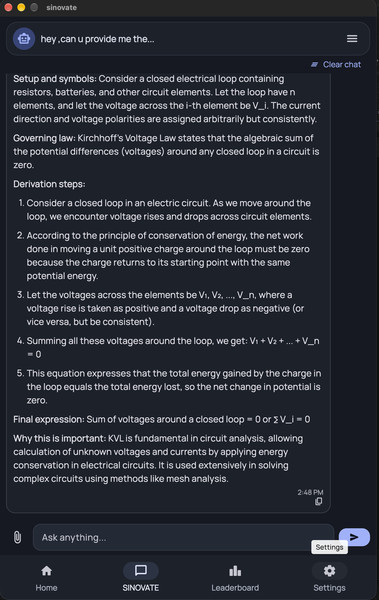
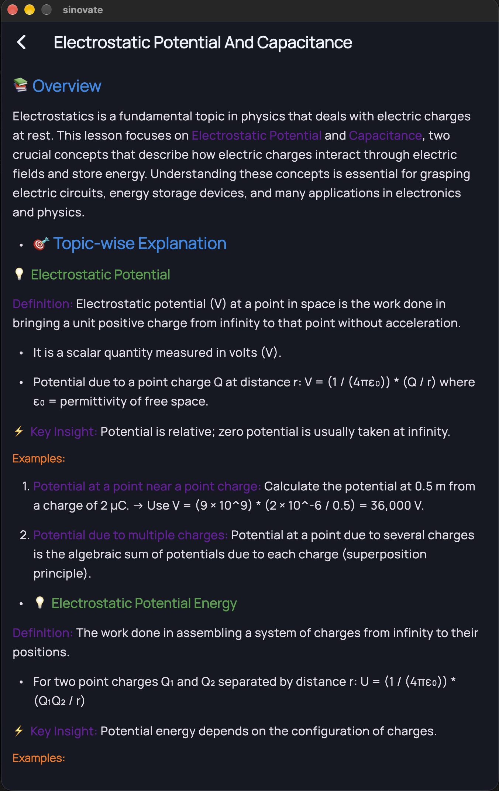
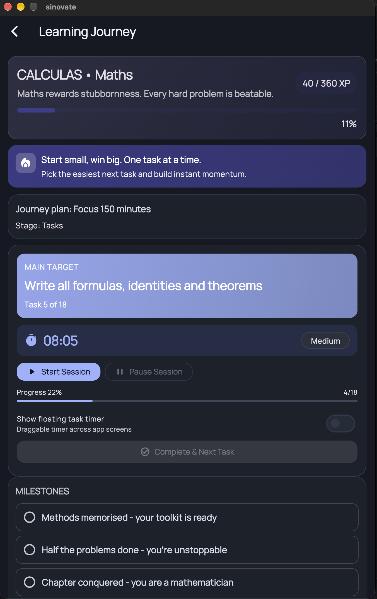
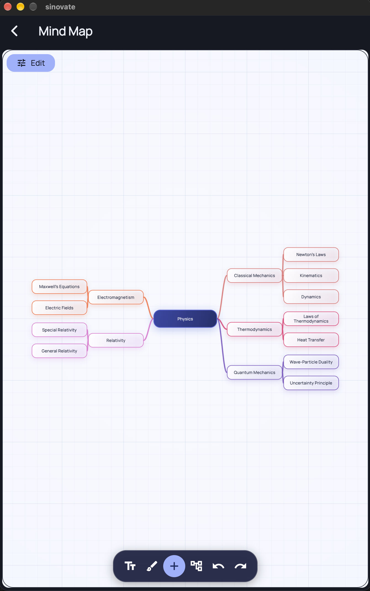
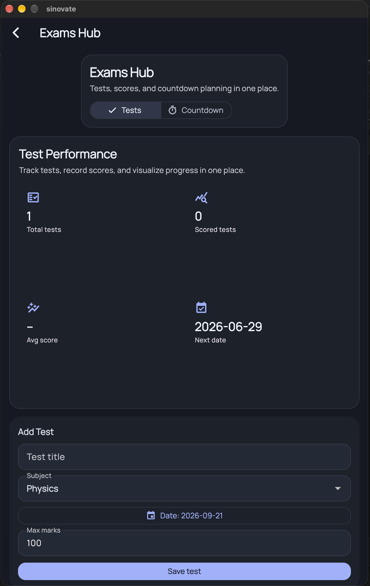
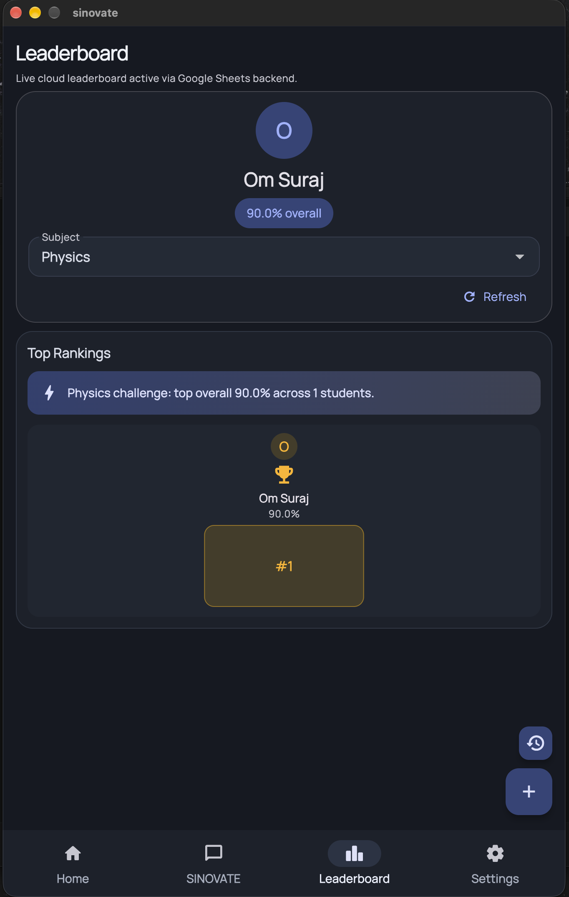

<div align="center">

# SINOVATE — School Assistant

**An all-in-one, AI-powered study companion for students.**


</div>

---

## 📋 Table of Contents

- [About](#-about)
- [Features](#-features)
- [Screenshots](#-screenshots)
- [Tech Stack](#-tech-stack)
- [Project Structure](#-project-structure)
- [Getting Started](#-getting-started)
- [Configuration](#️-configuration)
- [Building for Release](#-building-for-release)
- [Release Notes](#-release-notes)
- [Author](#-author)

## 🧠 About

SINOVATE is a cross-platform study assistant built for students. It brings together AI tutoring, automated note generation, structured learning journeys, exam planning, and collaborative study tools into a single, cohesive mobile experience — designed to remove the friction between studying and everything around it.

## ✨ Features

### AI-Powered Learning
- **AI Tutor** — conversational tutoring grounded in retrieval-based context for accurate, relevant answers
- **Image-Based Questions** — capture a question with your camera and get instant help
- **Smart Note Generation** — generate structured notes from topics, custom details, or attached files
- **Markdown Notes** — read and edit notes with local storage support

### Guided Learning
- **Learning Journey** — subject checklists, XP-based progression, milestones, and completion rewards
- **Custom Subjects** — optionally define your own subjects and track them end-to-end

### Study Tools
- **Mind Map Studio** — landscape-first interactive canvas with tree-style branching, heading/subheading mapping, and full zoom & pan controls
- **Study Planner** — exam countdowns paired with a distraction-free focus mode
- **Focus Timer** — persistent timer state that resumes across sessions

### Tracking & Insights
- **Test Tracking** — log results and monitor performance trends over time
- **Results Leaderboard** — share test percentages and compete in subject-wise rankings (Physics, Chemistry, Mathematics), with optional cloud sync
- **Calendar View** — unified view of upcoming tests, tasks, and homework

### Collaboration
- **Study Rooms** — collaborative spaces with content sharing and group utilities

### Platform
- Light & dark themes
- Local-first persistence for progress, settings, and drafts

## 📱 Screenshots

| | | |
|:---:|:---:|:---:|
| **AI Tutor** | **Smart Notes** | **Learning Journey** |
|  |  |  |
| **Mind Map Studio** | **Study Planner** | **Leaderboard** |
|  |  |  |

## 🛠 Tech Stack

| Layer | Technology |
|---|---|
| Mobile Client | Flutter |
| Backend API | FastAPI (Python) |
| AI Workflows | LangChain + OpenAI |
| Retrieval | FAISS Vector Store |
| Client Persistence | SharedPreferences |

## 📂 Project Structure

```
sinovate/
├── mobile_app/          # Flutter application
├── backend_api.py       # FastAPI entry point
├── vectorstore/         # FAISS index files
├── scripts/             # Utility and helper scripts
└── requirements.txt     # Backend dependencies
```

## 🚀 Getting Started

### Prerequisites

- Flutter SDK
- Python 3.10+
- An OpenAI API key

### 1. Set Up the Backend

From the repository root:

```bash
python -m venv .venv
source .venv/bin/activate         # Windows: .venv\Scripts\activate
pip install -r requirements.txt

uvicorn backend_api:app --host 0.0.0.0 --port 8000 --reload
```

### 2. Run the Flutter App

```bash
cd mobile_app
flutter pub get

# Local device / desktop
flutter run --dart-define=BACKEND_BASE_URL=http://127.0.0.1:8000

# Android emulator
flutter run --dart-define=BACKEND_BASE_URL=http://10.0.2.2:8000
```

## ⚙️ Configuration

| Dart Define | Required | Description |
|---|:---:|---|
| `BACKEND_BASE_URL` | ✅ | Base URL of the FastAPI backend |
| `LEADERBOARD_APPS_SCRIPT_URL` | — | Optional Google Apps Script endpoint for leaderboard cloud sync |

## 📦 Building for Release

### Android (APK)

```bash
cd mobile_app
flutter build apk --release
```

Output: `mobile_app/build/app/outputs/flutter-apk/app-release.apk`

With leaderboard sync enabled:

```bash
flutter build apk --release \
  --dart-define=LEADERBOARD_APPS_SCRIPT_URL=https://your-script-url/exec
```

### iOS (Signed IPA)

Requirements: Xcode installed and selected, Apple signing configured, CocoaPods.

```bash
sudo xcode-select --switch /Applications/Xcode.app/Contents/Developer
sudo xcodebuild -runFirstLaunch

cd mobile_app
flutter build ipa --release
```

## 📝 Release Notes

- To-Do and Timetable modules removed
- Mind mapping moved from Notes into a dedicated **Mind Map Studio** under More Tools

## 👤 Author

**Om Suraj Kashikar**
